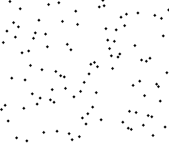

# DSA Algorithms in C++

## 1. Sorting Algorithms

### Bubble Sort
```cpp
void bubbleSort(vector<int>& arr) {
    int n = arr.size();
    for (int i = 0; i < n - 1; i++) {
        for (int j = 0; j < n - i - 1; j++) {
            if (arr[j] > arr[j + 1])
                swap(arr[j], arr[j + 1]);
        }
    }
}
```


### Selection Sort
```cpp
void selectionSort(vector<int>& arr) {
    int n = arr.size();
    for (int i = 0; i < n - 1; i++) {
        int minIdx = i;
        for (int j = i + 1; j < n; j++)
            if (arr[j] < arr[minIdx])
                minIdx = j;
        swap(arr[minIdx], arr[i]);
    }
}


```

### Insertion Sort
```cpp
void insertionSort(vector<int>& arr) {
    int n = arr.size();
    for (int i = 1; i < n; i++) {
        int key = arr[i];
        int j = i - 1;
        while (j >= 0 && arr[j] > key) {
            arr[j + 1] = arr[j];
            j--;
        }
        arr[j + 1] = key;
    }
}


```


### Merge Sort
```cpp
void merge(vector<int>& arr, int l, int mid, int r){
        int indx1 = l;
        int indx2 = mid +1;
        
        vector<int> temp;
        
        while(indx1<=mid && indx2<=r){
            if(arr[indx1]<=arr[indx2]){
                temp.push_back(arr[indx1]);
                indx1++;
            }
            else{
                temp.push_back(arr[indx2]);
                indx2++;
                
            }
        }
        
        while(indx1<=mid){
            temp.push_back(arr[indx1]);
            indx1++;
        }
        while(indx2<=r){
            temp.push_back(arr[indx2]);
            indx2++;
        }
        
        for(int i=l; i<=r; i++){
            arr[i]= temp[i-l];
        }
    }

void mergeSort(vector<int>& arr, int l, int r) {
    if (l < r) {
        int m = l + (r - l) / 2;
        mergeSort(arr, l, m);
        mergeSort(arr, m + 1, r);
        merge(arr, l, m, r);
    }
}


```

### Quick Sort
```cpp
int partition(vector<int>& arr, int low, int high) {
    int pivot = arr[high];
    int i = low - 1;
    for (int j = low; j < high; j++) {
        if (arr[j] < pivot)
            swap(arr[++i], arr[j]);
    }
    swap(arr[i + 1], arr[high]);
    return i + 1;
}

void quickSort(vector<int>& arr, int low, int high) {
    if (low < high) {
        int pi = partition(arr, low, high);
        quickSort(arr, low, pi - 1);
        quickSort(arr, pi + 1, high);
    }
}


```

## 2. Searching Algorithms
### Linear Search
```cpp
int linearSearch(vector<int>& arr, int x) {
    for (int i = 0; i < arr.size(); i++) {
        if (arr[i] == x) return i;
    }
    return -1;
}


```
### Binary Search (Iterative)
```cpp
int binarySearch(vector<int>& arr, int x) {
    int low = 0, high = arr.size() - 1;
    while (low <= high) {
        int mid = low + (high - low) / 2;
        if (arr[mid] == x)
            return mid;
        else if (arr[mid] < x)
            low = mid + 1;
        else
            high = mid - 1;
    }
    return -1;
}


```
### Binary Search (Recursive)
```cpp
int binarySearchRecursive(vector<int>& arr, int low, int high, int x) {
    if (low > high) return -1;
    int mid = low + (high - low) / 2;
    if (arr[mid] == x) return mid;
    if (arr[mid] > x) return binarySearchRecursive(arr, low, mid - 1, x);
    return binarySearchRecursive(arr, mid + 1, high, x);
}

```
## 3. Greedy Algorithms
### Activity Selection
```cpp
struct Activity {
    int start, finish;
};

bool compare(Activity s1, Activity s2) {
    return s1.finish < s2.finish;
}

void activitySelection(vector<Activity>& activities) {
    sort(activities.begin(), activities.end(), compare);
    int count = 1, lastFinish = activities[0].finish;
    for (int i = 1; i < activities.size(); i++) {
        if (activities[i].start >= lastFinish) {
            count++;
            lastFinish = activities[i].finish;
        }
    }
    cout << "Max activities: " << count << endl;
}


```
## 4. Dynamic Programming
### Fibonacci (DP)
```cpp
int fibonacci(int n) {
    vector<int> dp(n + 1);
    dp[0] = 0; dp[1] = 1;
    for (int i = 2; i <= n; i++)
        dp[i] = dp[i - 1] + dp[i - 2];
    return dp[n];
}


```
### Longest Common Subsequence (LCS)
```cpp
int lcs(string X, string Y) {
    int m = X.size(), n = Y.size();
    vector<vector<int>> dp(m + 1, n + 1);
    for (int i = 1; i <= m; i++) {
        for (int j = 1; j <= n; j++) {
            if (X[i - 1] == Y[j - 1])
                dp[i][j] = 1 + dp[i - 1][j - 1];
            else
                dp[i][j] = max(dp[i - 1][j], dp[i][j - 1]);
        }
    }
    return dp[m][n];
}


```
### 0/1 Knapsack
```cpp
int knapsack(vector<int>& wt, vector<int>& val, int W) {
    int n = wt.size();
    vector<vector<int>> dp(n + 1, vector<int>(W + 1));
    for (int i = 1; i <= n; i++) {
        for (int w = 0; w <= W; w++) {
            if (wt[i - 1] <= w)
                dp[i][w] = max(val[i - 1] + dp[i - 1][w - wt[i - 1]], dp[i - 1][w]);
            else
                dp[i][w] = dp[i - 1][w];
        }
    }
    return dp[n][W];
}

```
## 5. Graph Algorithms
### Depth First Search (DFS)
```cpp
void dfs(vector<vector<int>>& adj, vector<bool>& visited, int v) {
    visited[v] = true;
    for (int u : adj[v])
        if (!visited[u])
            dfs(adj, visited, u);
}

```
### Breadth First Search (BFS)
```cpp
void bfs(vector<vector<int>>& adj, int v) {
    queue<int> q;
    vector<bool> visited(adj.size(), false);
    q.push(v); visited[v] = true;
    while (!q.empty()) {
        int node = q.front(); q.pop();
        for (int u : adj[node]) {
            if (!visited[u]) {
                visited[u] = true;
                q.push(u);
            }
        }
    }
}

```
### Dijkstra's Algorithm
```cpp
vector<int> dijkstra(vector<vector<pair<int, int>>>& adj, int src) {
    int n = adj.size();
    vector<int> dist(n, INT_MAX);
    priority_queue<pair<int, int>, vector<pair<int, int>>, greater<>> pq;
    pq.push({0, src});
    dist[src] = 0;
    
    while (!pq.empty()) {
        int u = pq.top().second;
        pq.pop();
        for (auto& [v, weight] : adj[u]) {
            if (dist[u] + weight < dist[v]) {
                dist[v] = dist[u] + weight;
                pq.push({dist[v], v});
            }
        }
    }
    return dist;
}

```
## 6. Tree Algorithms
### Binary Tree Traversals (Inorder, Preorder, Postorder)
```cpp
void inorder(TreeNode* root) {
    if (!root) return;
    inorder(root->left);
    cout << root->val << " ";
    inorder(root->right);
}

void preorder(TreeNode* root) {
    if (!root) return;
    cout << root->val << " ";
    preorder(root->left);
    preorder(root->right);
}

void postorder(TreeNode* root) {
    if (!root) return;
    postorder(root->left);
    postorder(root->right);
    cout << root->val << " ";
}

```
## 7. Miscellaneous
### Two Pointer Technique
```cpp
bool twoSum(vector<int>& arr, int target) {
    sort(arr.begin(), arr.end());
    int left = 0, right = arr.size() - 1;
    while (left < right) {
        int sum = arr[left] + arr[right];
        if (sum == target)
            return true;
        else if (sum < target)
            left++;
        else
            right--;
    }
    return false;
}

```
### Sliding Window Technique
```cpp
int maxSumSubarray(vector<int>& arr, int k) {
    int n = arr.size(), maxSum = 0, currSum = 0;
    for (int i = 0; i < k; i++) currSum += arr[i];
    maxSum = currSum;
    for (int i = k; i < n; i++) {
        currSum += arr[i] - arr[i - k];
        maxSum = max(maxSum, currSum);
    }
    return maxSum;
}

```
